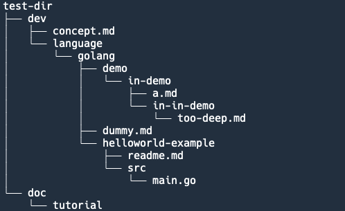

# Markdown Tree

This tool extracts the  target directory hierarchy and converts it to a markdown file.

## Prerequisites

* Install go first.

## Usage

`go run ./main.go --input-dir ${input-dir} --output-file ${output-file}`

## Rules

* Directories will become to heading lines with level according to its depth of the root dir.
* Files will become to items of list.
* Only support 6 levels since markdown only has 6 levels.

**Special Case**

* Directories with "-example" suffix will be list items, too.

## Example



The directory hierarchy as shown above  will be converted to markdown format as bellow.

 ``` markdown
 # test-dir
 ## dev
 - concept.md
 ### language
 #### golang
 - dummy.md
 - helloworld-example
 ##### demo
 ###### in-demo
 - in-in-demo
 - a.md
 ## doc
 ### tutorial
 ```

